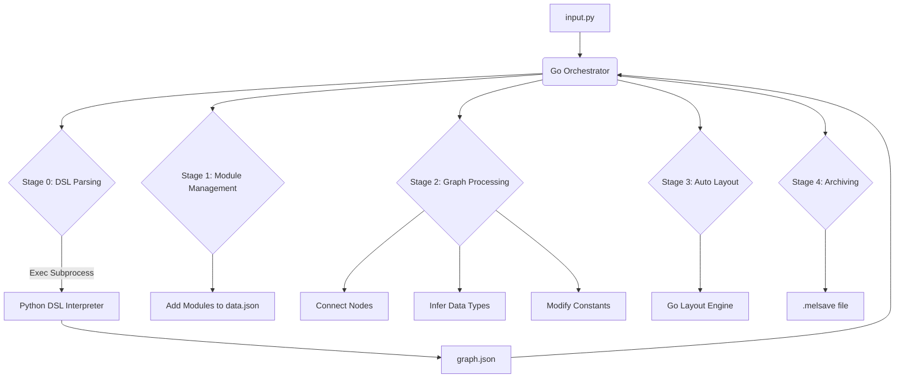

# Refactoring Plan: Python to Go

## 1. 目标 (Objectives)
- **性能提升**: Go 在处理大规模 JSON 和复杂图算法（如自动布局）时比 Python 更快。
- **类型安全**: 使用 Go 的强类型系统减少数据操作中的潜在错误。
- **架构清晰**: 将逻辑拆分为清晰的 Go 包，完善接口设计和调用逻辑。
- **保留 Python DSL**: 继续使用 Python 解释器来处理基于 AST 的 DSL 解析，确保现有的 `input.py` 语法兼容。

## 2. 架构设计 (Architecture)

### 2.1 整体流程

### 2.2 包结构建议
- `main.go`: 程序入口，处理命令行参数。
- `pkg/config`: 管理路径、模糊匹配阈值等配置。
- `pkg/converter`: 封装对 Python 脚本的调用。
- `pkg/game`: 核心包，处理 `data.json` 的解析、模块添加、连线。
- `pkg/graph`: 定义 `graph.json` 的模型及相关的图操作。
- `pkg/layout`: 移植后的自动布局引擎。
- `pkg/archive`: 处理 `.melsave` (Zip) 的创建。
- `pkg/utils`: 模糊匹配算法、JSON 通用工具。

## 3. 详细迁移步骤 (Implementation Details)

### 3.1 Python 桥接 (Bridge)
- 保留 `src/converter/` 目录。
- Go 通过 `os/exec` 调用 `python converter_v2.py <input> <output>`。
- 确保 Python 脚本只负责输出标准的 `graph.json`。

### 3.2 游戏数据处理 (Game Data)
- 定义 `SaveObject`, `MetaData`, `ChipGraph` 等 Go 结构体。
- `batch_add_modules` 的逻辑将转化为 Go 的方法，直接操作内存中的结构体。
- 优化 UUID 生成和节点 ID 归一化逻辑。

### 3.3 布局引擎 (Layout Engine)
- 将 ALAP 分层、质心迭代 (Barycenter) 和鱼群交换 (Fish school swap) 算法逐行移植。
- 利用 Go 的并发特性（如果必要）优化多轮迭代。

### 3.4 接口优化 (API Refinement)
- 建立统一的 `Pipeline` 接口，允许以后插入不同的转换器或处理器。
- 统一错误处理机制，返回结构化的错误信息。

## 4. 待确认事项 (To-be-confirmed)
- 是否需要支持 Linux/macOS（目前项目中有 Windows 特有的编码处理）？
- Go 的二进制文件是否需要内置 Python 脚本（使用 `go:embed`）？
